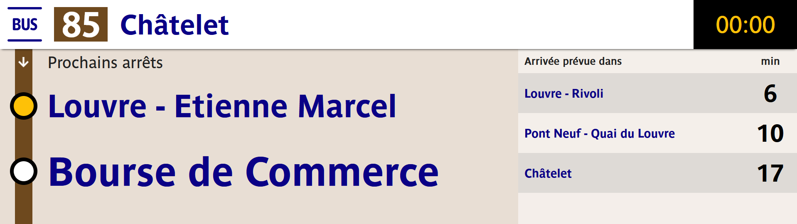
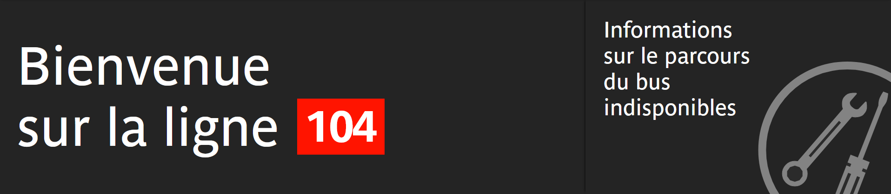
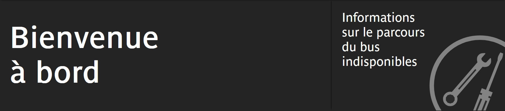
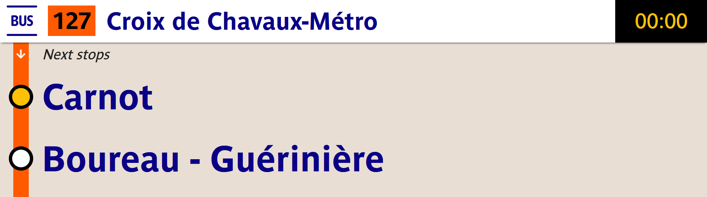
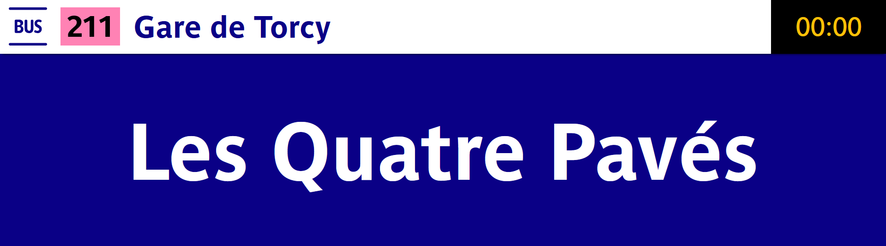
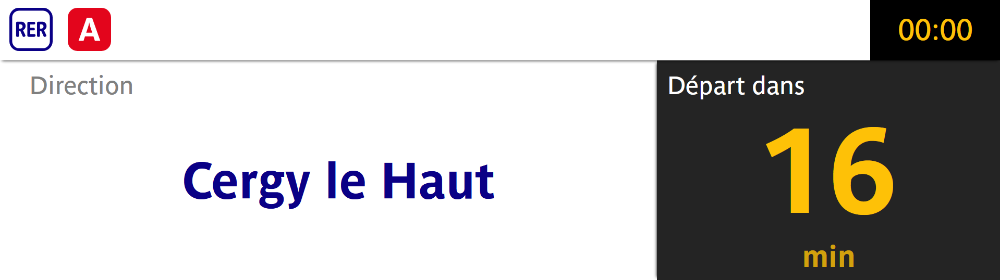
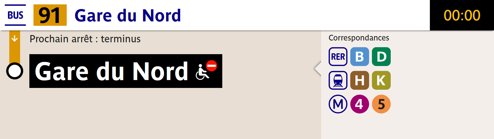
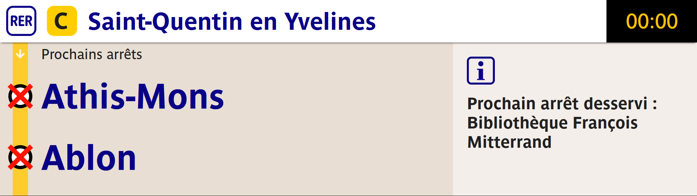
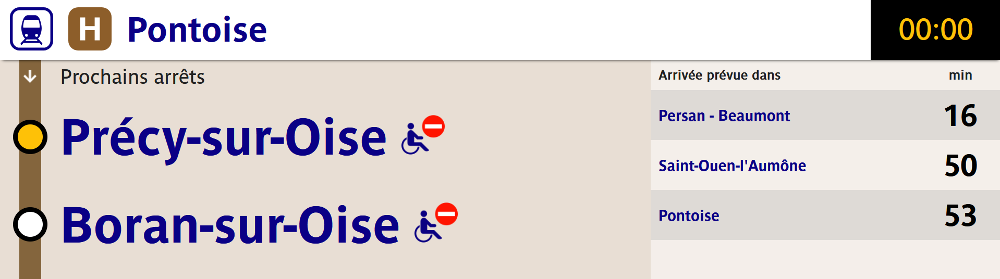

# Ecran Lumiplan -- RATP
Dépot Git pour la reproduction de l'écran d'affichage à l'intérieur des bus RATP 


> [!WARNING]
> Attention : L'écran est encore en développement, toutes les fonctionnalités ne sont pas encore disponibles et certaines peuvent être instables.


## Démo de l'écran
L'écran est en ligne et disponible à la sélection sur le site suivant :
- https://lumiplan.leon.gp/
> [!NOTE]
> Pour l'instant les desserves affichées sont en temps théorique et non en temps réel

> [!IMPORTANT]
> Pour l'instant, seules les courses dans la fourchette [-90min;+25min] sont disponibles


Vous n'avez qu'à choisir une ligne et une course. Toutes les lignes d'Île-de-France sont disponibles


## Mise en place du projet
Récupérer le code du projet avec :
```sh
git clone git@github.com:Leon-ED/lumiplan-ratp.git
```
Se mettre dans le dossier
```sh
cd lumiplan-ratp/
```
Installer les dépendances

```sh
npm install
```
Lancer l'environnement de dev
```sh
npm run dev
```
Par défaut le projet sera disponible dans le navigateur avec l'url

> http://localhost:5173/

## Paramétrer l'affichage
Une fois les dépendances installées et le projet lancé, il faut récupérer 2 paramètres.

- `trip` : Identifiant de la course ([à récupérer depuis le GTFS](https://data.iledefrance-mobilites.fr/explore/dataset/offre-horaires-tc-gtfs-idfm/table/)), récupérer le champ 'trip_id' du fichier `trips.txt` 

> [!IMPORTANT]
> Pour l'instant, seules les courses dans la fourchette [-90min;+25min] sont disponibles, sinon l'écran ne parviendra pas à charger la desserte


- `line` : Identifiant de la ligne ([liste ici](https://data.iledefrance-mobilites.fr/explore/dataset/referentiel-des-lignes/table/?disjunctive.transportsubmode&disjunctive.operatorname&disjunctive.networkname&disjunctive.transportmode&disjunctive.id_bus_contrat)), récupérer le champ 'ID_Line'

> [!TIP]
> Il est possible de mettre un identifiant de ligne qui ne correspond pas à la course (mettre une course du RER B et l'identifiant de ligne du bus TVM)
### Erreurs de chargement
#### Erreur de course
Si la course n'existe pas, qu'elle est terminée car l'heure d'arrivée au terminus est dépassée ou si une erreur est survenue lors de son chargement cet écran apparaîtra 

#### Erreur de ligne
Si la ligne n'existe pas ou si une erreur est survenue lors de son chargement cet écran apparaîtra 



## Exemples








## Contribuer

Vous pouvez fork le projet pour proposer des pull requests.

Pour les PR, merci de :
- __Joindre des images__ réelles si les modifications concernent l'interface.
- Indiquer les modifications effectuées et dans quel but. 

## Sources des données
Certaines données utilisées dans ce projet proviennent d'Île-de-France Mobilités ([PRIM](https://prim.iledefrance-mobilites.fr/fr)).

Ces données sont soumises à leurs licences respectives (Licence Ouverte Etalab, ODbL, Licence Mobilité ou autre selon le type de données).

[© Île-de-France Mobilités](https://prim.iledefrance-mobilites.fr/fr/licences)

## Disclaimer
Ce projet est un projet indépendant et non officiel.

Il n’est en aucun cas affilié, associé, autorisé, soutenu ou approuvé par Île-de-France Mobilités, RATP, SNCF, ni par aucun autre opérateur de transport public.

Toutes les marques, noms commerciaux et logos mentionnés restent la propriété exclusive de leurs détenteurs respectifs.

Les données éventuellement utilisées proviennent de sources publiques ou ouvertes. Ce projet est développé à des fins informatives et communautaires uniquement.
## 
[Discord communautaire](https://discord.gg/ZkzaKMhTea)
[Hub des différents écrans](https://prochainstrains.arno.cl/)
[Wagon](https://getwagon.fr/)

